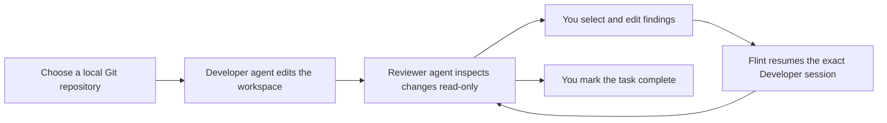

# Flint

> A local-first control room for AI coding agents.

**Let one AI build. Let another challenge it. You decide what ships.**

[简体中文](./README_CN.md)

[](https://github.com/airene/flint/stargazers)
[](./LICENSE)
[](https://bun.sh/)

Flint is an open-source, local-first workspace for running a **Developer agent** and an independent, read-only **Reviewer agent** against your existing Git repositories. Use Codex CLI or Claude Code in either role, inspect every proposed change, curate the review findings, and send only the feedback you approve back to the exact developer session.

It is both a practical multi-agent development workflow and a reference project for developers building AI coding tools with Bun, TypeScript, Vue, SQLite, WebSockets, and real coding-agent CLIs.

If this is the kind of AI coding workflow you want to see grow, [give Flint a star](https://github.com/airene/flint) and follow the project.

## Why Flint?

- **Independent AI code review** — separate code generation from review instead of asking one agent to judge its own work.
- **Human-controlled feedback** — findings are never forwarded automatically; you select, edit, or reject them first.
- **Local by design** — repositories, prompts, activity, reviews, and task history stay on your machine.
- **Real session continuity** — feedback resumes the exact persisted Developer session, not a guessed “latest” session.
- **Provider-flexible roles** — Codex CLI and Claude Code can each act as Developer or Reviewer.
- **A useful foundation for builders** — study a working AI coding agent orchestration stack without starting from a toy chat interface.

## Who is it for?

Flint is for developers who:

- want an AI coding workflow with a second agent checking the first;
- need automated code review without an uncontrolled agent-to-agent loop;
- prefer subscription-authenticated CLIs over managing API keys;
- want to learn how to build local AI developer tools, coding-agent control planes, or multi-agent systems.

## How it works



1. Register an existing local Git repository.
2. Create a task and start its configured Developer CLI.
3. Inspect the activity stream and Git diff.
4. Run the configured Reviewer CLI inside a strict read-only permission envelope.
5. Select findings, add your own notes, and edit the feedback preview.
6. Send approved feedback back to the exact Developer session, review again, or complete the task.

Flint never starts an automatic Developer/Reviewer loop. Every run and every feedback delivery remains an explicit human decision.

## Quick start

### Requirements

- [Bun](https://bun.sh/) 1.3 or newer
- Git
- At least one authenticated agent CLI:
  - [OpenAI Codex CLI](https://github.com/openai/codex)
  - [Claude Code](https://code.claude.com/docs/en/overview)

Both CLIs are supported in both roles. Install and authenticate both if you want to mix providers freely. Flint uses your existing CLI subscription sessions and does not require OpenAI or Anthropic API keys.

### Install and run

```bash
git clone https://github.com/airene/flint.git
cd flint
bun install
bun run dev
```

Open the URL printed by Vite, register a repository by its absolute path, and create your first task.

Authenticate the CLI or CLIs you plan to use before starting Flint:

```bash
codex login
claude auth login
```

The API listens only on `127.0.0.1:3000`. During development, Vite proxies `/api` and `/ws` to the local server.

### Production build

```bash
bun run build
bun apps/server/dist/index.js
```

The built Vue app, API, and WebSocket endpoint are served from one loopback-only Bun process.

## Built for users and AI-tool builders

Flint is deliberately more than a prompt box. It demonstrates the less glamorous parts of reliable AI coding infrastructure:

- spawning and supervising real Codex and Claude CLI processes;
- normalizing streamed agent events while retaining raw events;
- persisting tasks, runs, findings, feedback, and exact external session IDs;
- enforcing different permission envelopes for writable and read-only roles;
- reconciling agent activity with Git state and stale review snapshots;
- recovering interrupted work without silently retrying or spending subscription quota.

### Architecture

```text
Vue 3 Web UI
  ├─ projects, tasks, activity, Git diff, review, feedback
  └─ HTTP + WebSocket
              │
              ▼
Bun Local Server
  ├─ workflow and task services
  ├─ Git integration
  ├─ SQLite persistence with Drizzle ORM
  └─ agent driver registry
       ├─ Codex CLI driver
       └─ Claude Code driver
```

| Layer | Technology |
| --- | --- |
| Runtime | Bun + TypeScript |
| Frontend | Vue 3, Vite, Pinia, Vue Router, Monaco Editor |
| Server | `Bun.serve()`, WebSocket, `Bun.spawn()` |
| Storage | Local SQLite + Drizzle ORM |
| Agents | Codex CLI and Claude Code |
| Validation | Zod, Bun tests, Playwright |

## Role configuration

In **CLI Settings**, choose global defaults for `Developer CLI` and `Reviewer CLI`. The default combination is Codex Developer and Claude Reviewer, but either provider can fill either role, including using the same provider for both.

Role selections apply only to new tasks. A task preserves the providers and exact Developer session selected when it was created, so later settings changes cannot redirect existing work.

## Local data and configuration

Flint stores its SQLite database at:

```text
~/.local-pair-review/data/app.db
```

Override the database for an isolated instance:

```bash
LOCAL_PAIR_REVIEW_DATABASE=/absolute/path/to/data.sqlite bun run dev
```

Executable overrides must be absolute paths:

```bash
CODEX_EXECUTABLE=/absolute/path/to/codex
CLAUDE_EXECUTABLE=/absolute/path/to/claude
GIT_EXECUTABLE=/absolute/path/to/git
```

These paths can also be saved and rechecked in **CLI Settings**. Use `LOCAL_PAIR_REVIEW_WEB_ROOT` to override the built `apps/web/dist` directory when packaging Flint.

The web UI supports English and Simplified Chinese through `vue-i18n`. Your language choice is stored in browser `localStorage` as `flint.locale`.

## Security model

Flint is intentionally local-only:

- the server binds to loopback and rejects non-local browser requests;
- child processes receive an explicit working directory and argument array—Flint does not execute shell command strings;
- common API credential environment variables are removed before agent processes start;
- diagnostic output is redacted before it is stored or displayed;
- Flint never enables Claude Code's `bypassPermissions` mode.

Role permissions are different by design:

| Role | Codex CLI | Claude Code |
| --- | --- | --- |
| Developer | `workspace-write` sandbox | `acceptEdits` with the user's own permission configuration |
| Reviewer | `read-only` sandbox + structured review schema | `plan` mode + a narrow read-only tool allowlist + review JSON schema |

Reviewer edit/write tools, destructive Git operations, commits, and pushes are blocked at the CLI boundary.

### Unattended CLI approvals

Flint runs each CLI as an unattended batch process: it writes the prompt to stdin once, closes stdin, and then reads the event stream. It cannot answer an interactive per-operation approval prompt during that run.

Configure each Developer CLI to auto-approve operations that are already inside Flint's permission envelope:

- **Codex** — configure automatic approval in `~/.codex/config.toml`, for example `approval_policy = "never"`. The `workspace-write` sandbox still applies.
- **Claude Code** — enable auto-accept in your Claude configuration so tools allowed by `acceptEdits` do not block the run.

The in-app approval relay is currently dormant until the drivers support bidirectional stdin and approval-event responses.

## Development and verification

```bash
bun test
bun run typecheck
bun run test:e2e
bun run build
```

The E2E suite uses fake Codex and Claude fixtures plus isolated temporary Git repositories. It does not access your agent subscriptions.

Real-CLI smoke tests are intentionally excluded from normal tests and CI because they consume authenticated CLI sessions:

```bash
bun run smoke:codex
bun run smoke:claude
```

Each command creates a dedicated temporary repository and waits for the exact confirmation text `RUN` before invoking a real CLI. These smoke tests have not been run for the current documented checkout.

## Current scope

Flint does not currently provide automatic agent loops, remote access, user accounts, worktrees, commits, pull requests, pushes, or cloud synchronization. Only an explicitly started or resumed Developer run can modify a registered repository. Interrupted and failed runs remain visible with manual recovery paths; Flint does not silently retry them.

## License

[MIT](./LICENSE) © 2026 Airene Fang
