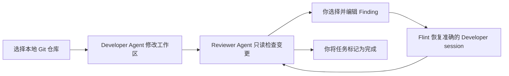

# Flint

> 面向 AI 编程 Agent 的本地优先控制台。

**让一个 AI 负责开发，让另一个 AI 负责质疑，最终由你决定交付什么。**

[English](./README.md)

[](https://github.com/airene/flint/stargazers)
[](./LICENSE)
[](https://bun.sh/)

Flint 是一个开源、本地优先的工作台，可以在你已有的 Git 仓库中协调一个 **Developer Agent** 和一个独立、只读的 **Reviewer Agent**。Codex CLI 与 Claude Code 均可担任任一角色；你可以检查每次代码变更、筛选 Review Finding，并且只把自己认可的反馈发送回准确的 Developer session。

它既是一套实用的多 Agent 开发工作流，也是一个供开发者研究 AI coding 工具的参考项目，涵盖 Bun、TypeScript、Vue、SQLite、WebSocket，以及真实编程 Agent CLI 的集成。

如果你也期待这样的 AI coding 工作流继续成长，欢迎为 [Flint 点一个 Star](https://github.com/airene/flint) 并关注后续进展。

## 为什么选择 Flint？

- **独立的 AI 代码评审** — 将代码生成与 Review 分离，避免让同一个 Agent 既当选手又当裁判。
- **人工控制反馈** — Finding 永远不会被自动转发；你可以先选择、修改或拒绝。
- **真正本地运行** — 仓库、Prompt、运行记录、Review 和任务历史都保留在你的电脑上。
- **准确延续会话** — Feedback 恢复持久化的准确 Developer session，而不是猜测“最近一次”会话。
- **角色可自由配置** — Codex CLI 与 Claude Code 均可担任 Developer 或 Reviewer。
- **适合 AI 工具开发者研究** — 从一套真实的 AI coding agent 编排架构起步，而不只是一个简单聊天界面。

## 谁适合使用 Flint？

Flint 适合这些开发者：

- 希望用第二个 Agent 检查第一个 Agent 代码的人；
- 需要自动化代码评审，但不希望 Agent 之间失控循环的人；
- 更喜欢复用 CLI 订阅登录，而不是自行管理 API Key 的人；
- 想学习如何构建本地 AI 开发工具、Coding Agent 控制面或多 Agent 系统的人。

## 工作原理



1. 注册一个现有的本地 Git 仓库。
2. 创建 Task，并启动其配置的 Developer CLI。
3. 检查实时 Activity 与 Git Diff。
4. 在严格的只读权限范围内启动 Reviewer CLI。
5. 选择 Finding、添加人工备注并编辑 Feedback 预览。
6. 将确认后的 Feedback 发回准确的 Developer session，然后再次 Review 或完成任务。

Flint 不会启动自动的 Developer/Reviewer 循环。每一次 Run 和每一次 Feedback 发送，都必须由人明确决定。

## 快速开始

### 环境要求

- [Bun](https://bun.sh/) 1.3 或更高版本
- Git
- 至少一个已经登录的 Agent CLI：
  - [OpenAI Codex CLI](https://github.com/openai/codex)
  - [Claude Code](https://code.claude.com/docs/en/overview)

两个 CLI 均支持两个角色。如果希望自由组合 Provider，请同时安装并登录它们。Flint 复用现有的 CLI 订阅会话，不需要 OpenAI 或 Anthropic API Key。

### 安装并运行

```bash
git clone https://github.com/airene/flint.git
cd flint
bun install
bun run dev
```

打开 Vite 输出的地址，使用绝对路径注册一个仓库，然后创建第一个 Task。

启动 Flint 前，请先登录计划使用的 CLI：

```bash
codex login
claude auth login
```

API 仅监听 `127.0.0.1:3000`。开发期间，Vite 会将 `/api` 和 `/ws` 代理到本地 Server。

### 生产构建

```bash
bun run build
bun apps/server/dist/index.js
```

构建后的 Vue 应用、API 与 WebSocket Endpoint 由同一个仅监听 loopback 的 Bun 进程提供。

## 为使用者与 AI 工具开发者而构建

Flint 不只是一个 Prompt 输入框。它展示了可靠 AI coding 基础设施中不显眼但很关键的部分：

- 启动并监管真实的 Codex 与 Claude CLI 进程；
- 规范化流式 Agent Event，同时保留原始事件；
- 持久化 Task、Run、Finding、Feedback 与准确的外部 Session ID；
- 为可写与只读角色施加不同的权限边界；
- 协调 Agent Activity、Git 状态与过期的 Review Snapshot；
- 恢复被中断的工作，同时避免静默重试或消耗订阅额度。

### 架构

```text
Vue 3 Web UI
  ├─ 项目、任务、Activity、Git Diff、Review、Feedback
  └─ HTTP + WebSocket
              │
              ▼
Bun Local Server
  ├─ 工作流与任务服务
  ├─ Git 集成
  ├─ SQLite + Drizzle ORM 持久化
  └─ Agent Driver Registry
       ├─ Codex CLI Driver
       └─ Claude Code Driver
```

| 层级 | 技术 |
| --- | --- |
| Runtime | Bun + TypeScript |
| Frontend | Vue 3、Vite、Pinia、Vue Router、Monaco Editor |
| Server | `Bun.serve()`、WebSocket、`Bun.spawn()` |
| Storage | 本地 SQLite + Drizzle ORM |
| Agents | Codex CLI 与 Claude Code |
| Validation | Zod、Bun Test、Playwright |

## 角色配置

在 **CLI Settings** 中可以选择 `Developer CLI` 与 `Reviewer CLI` 的全局默认值。默认组合是 Codex Developer 与 Claude Reviewer，但任一 Provider 都能担任任一角色，也可以使用同一个 Provider 承担两个角色。

角色配置只影响新建 Task。Task 会保留创建时选择的 Provider 和准确的 Developer session，因此之后修改设置不会改变已有任务的执行对象。

## 本地数据与配置

Flint 默认将 SQLite 数据库保存在：

```text
~/.local-pair-review/data/app.db
```

可以为独立实例覆盖数据库路径：

```bash
LOCAL_PAIR_REVIEW_DATABASE=/absolute/path/to/data.sqlite bun run dev
```

Executable 覆盖值必须使用绝对路径：

```bash
CODEX_EXECUTABLE=/absolute/path/to/codex
CLAUDE_EXECUTABLE=/absolute/path/to/claude
GIT_EXECUTABLE=/absolute/path/to/git
```

这些路径也可以在 **CLI Settings** 中保存并重新检查。打包 Flint 时，可以使用 `LOCAL_PAIR_REVIEW_WEB_ROOT` 覆盖构建后的 `apps/web/dist` 目录。

Web UI 通过 `vue-i18n` 支持英文与简体中文。语言选择会以 `flint.locale` 保存在浏览器 `localStorage` 中。

## 安全模型

Flint 特意设计为仅在本地运行：

- Server 只绑定 loopback 地址，并拒绝非本地浏览器请求；
- 子进程使用明确的 Working Directory 与参数数组，Flint 不执行 shell command string；
- 启动 Agent 进程前会移除常见的 API 凭据环境变量；
- 诊断输出在存储或显示前会经过脱敏；
- Flint 永远不会为 Claude Code 启用 `bypassPermissions`。

不同角色使用不同的权限边界：

| 角色 | Codex CLI | Claude Code |
| --- | --- | --- |
| Developer | `workspace-write` Sandbox | `acceptEdits`，并保留用户自己的权限配置 |
| Reviewer | `read-only` Sandbox + 结构化 Review Schema | `plan` Mode + 严格的只读工具 Allowlist + Review JSON Schema |

Reviewer 的编辑或写入工具、破坏性 Git 操作、Commit 与 Push 会在 CLI 边界被禁止。

### 无人值守 CLI 审批

Flint 以无人值守批处理方式运行 CLI：它将 Prompt 一次性写入 stdin，关闭 stdin，然后读取 Event Stream。因此它无法在 Run 期间应答逐操作审批提示。

请将每个 Developer CLI 配置为自动批准已经位于 Flint 权限边界内的操作：

- **Codex** — 在 `~/.codex/config.toml` 中配置自动审批，例如 `approval_policy = "never"`；`workspace-write` Sandbox 仍然有效。
- **Claude Code** — 在 Claude 配置中启用自动接受，避免 `acceptEdits` 允许的工具阻塞 Run。

应用内 Approval Relay 目前处于休眠状态，需要 Driver 支持双向 stdin 与审批事件回复后才能启用。

## 开发与验证

```bash
bun test
bun run typecheck
bun run test:e2e
bun run build
```

E2E 测试使用 Fake Codex、Fake Claude Fixture 与相互隔离的临时 Git 仓库，不会访问你的 Agent 订阅。

真实 CLI smoke test 会使用已登录的 CLI，因此有意排除在常规测试与 CI 之外：

```bash
bun run smoke:codex
bun run smoke:claude
```

每条命令都会创建专用的临时仓库，并在调用真实 CLI 前等待精确确认文本 `RUN`。当前文档对应的 Checkout 尚未执行这些 Smoke Test。

## 当前范围

Flint 目前不提供自动 Agent 循环、远程访问、用户系统、Worktree、Commit、Pull Request、Push 或云同步。只有明确启动或恢复的 Developer Run 才能修改已注册仓库。被中断或失败的 Run 会保持可见并提供人工恢复入口；Flint 不会静默重试。

## 许可证

[MIT](./LICENSE) © 2026 Airene Fang
