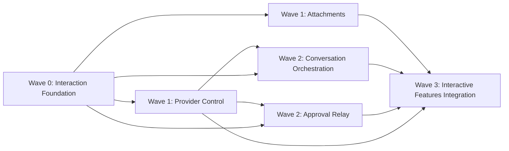

# CLI Continuous Interaction Orchestration Plan

> **For Codex:** Execute the linked child plans in dependency order. Use `superpowers:using-git-worktrees` before creating isolated workspaces and `superpowers:subagent-driven-development` when dispatching independent child plans.

**Goal:** Deliver review follow-up, initial and follow-up image attachments, in-run messages, single-Run role scheduling, and page-based one-time approval without merge conflicts between feature worktrees.

**Architecture:** This file is an orchestration index, not a second implementation checklist. The umbrella [design spec](../specs/2026-07-19-cli-continuous-interaction-design.md) owns behavior. A serial foundation establishes contracts; feature worktrees then produce isolated modules; one integration worktree alone edits shared composition roots, UI screens, stores, and broad tests.

**Tech Stack:** TypeScript, Bun, Hono, SQLite, Vue 3, Vitest, WebSocket, Codex CLI, Claude CLI

---

## Worktree Rules

1. At execution time, first detect whether the agent is already isolated. Prefer the product's native worktree support; otherwise create repository-local worktrees under the already ignored `.worktrees/` directory.
2. Create a child worktree only after all plans in its `Depends on` field have merged into the chosen base. Do not branch every wave from the original stale base.
3. There are four agent slots including the coordinator, so run at most three child agents at once. Start the fourth Wave 1 plan when a slot becomes free.
4. Each child owns only the files listed in its plan. Shared hotspots belong exclusively to the integration plan. If a feature needs a new wire, export a focused module and record the integration requirement in its handoff.
5. Before implementation, install dependencies if the worktree needs them and run a baseline `bun run typecheck` plus the closest existing tests. A failing baseline must be reported before feature edits.
6. Each child branch must end with focused tests, typecheck, a clean review of its diff, and an intentional commit. The coordinator merges completed dependencies before dispatching downstream work.

## Dependency Graph

## Execution Waves

### Wave 0 — serial foundation

Execute [Interaction Foundation](./2026-07-19-interaction-foundation.md) on `codex/interaction-foundation`. Merge it before creating any later worktree because every feature consumes its contracts and database ports.

### Wave 1 — parallel provider and attachments

From the merged foundation base, execute in parallel:

- [Provider Control](./2026-07-19-provider-control.md) on `codex/provider-control`.
- [Attachments](./2026-07-19-attachments.md) on `codex/attachments`.

Provider Control must finish before the two Wave 2 plans. Attachments may continue independently until integration.

### Wave 2 — parallel interaction behavior

After Provider Control and Foundation are merged into the base, execute in parallel:

- [Conversation Orchestration](./2026-07-19-conversation-orchestration.md) on `codex/conversation-orchestration`.
- [Approval Relay](./2026-07-19-approval-relay.md) on `codex/approval-relay`.

These plans use separate service and component files and must not wire themselves into shared application entry points.

### Wave 3 — serial integration

After all relevant child branches pass focused verification and are merged, execute [Interactive Features Integration](./2026-07-19-interactive-features-integration.md) on `codex/interactive-features-integration`. This is the only plan allowed to modify shared API composition, global stores, top-level views, realtime entry points, broad API/E2E tests, and README documentation.

## Coordinator Completion Gate

- Every acceptance criterion in the umbrella spec maps to at least one focused test and one integration test.
- Real Codex and Claude contract probes record separate initial-image and resumed-image results; unsupported combinations fail visibly instead of dropping attachments.
- No Task ever has Developer and Reviewer Runs active together.
- Reviewer follow-up remains read-only and resumes the exact selected Review session.
- Approval decisions are structured, idempotent, Developer-only, and limited to allow-once or deny.
- Run `bun run typecheck`, `bun test`, and the repository's E2E command from the final integration worktree before completion.

