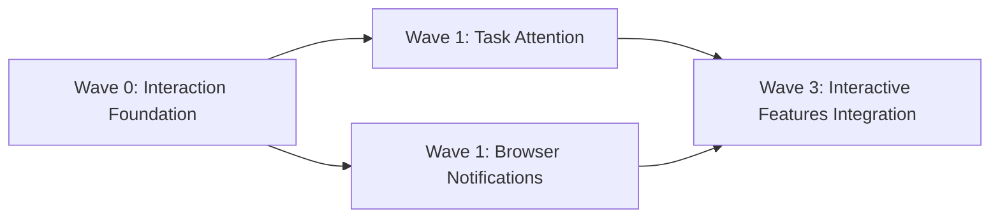

# Task Attention and Notifications Orchestration Plan

> **For Codex:** Execute the linked child plans in dependency order. Use `superpowers:using-git-worktrees` before creating isolated workspaces and `superpowers:subagent-driven-development` when dispatching independent child plans.

**Goal:** Add a global realtime list of unfinished Tasks and browser notifications for completed Developer/Reviewer Runs on the current Task, while keeping feature worktrees merge-safe.

**Architecture:** The umbrella [design spec](../specs/2026-07-19-task-attention-notifications-design.md) owns behavior. The shared foundation provides contracts; task attention and browser notifications are independent leaf modules; the common integration worktree wires navigation, current-Task events, settings, and broad tests.

**Tech Stack:** TypeScript, Bun, Hono, SQLite, Vue 3, Vitest, WebSocket, Browser Notification API

---

## Worktree Rules

Use the same isolation and ownership rules as the [CLI orchestration plan](./2026-07-19-cli-continuous-interaction.md): create worktrees from merged dependencies, run no more than three child agents beside the coordinator, keep shared hotspots exclusive to integration, and require focused verification plus an intentional commit from every child branch.

## Dependency Graph

## Execution Waves

### Wave 0 — shared serial dependency

Execute and merge [Interaction Foundation](./2026-07-19-interaction-foundation.md). It is shared with the CLI plan and must run only once.

### Wave 1 — parallel attention features

From the merged foundation base, execute independently:

- [Task Attention](./2026-07-19-task-attention.md) on `codex/task-attention`.
- [Browser Notifications](./2026-07-19-browser-notifications.md) on `codex/browser-notifications`.

These can run alongside Provider Control and Attachments from the CLI plan, subject to the three-child-agent limit. If all four are ready, start any three and dispatch the fourth when one finishes.

### Wave 3 — shared serial integration

After both feature branches and all required CLI branches are merged, use the single [Interactive Features Integration](./2026-07-19-interactive-features-integration.md) plan. Do not create a second integration branch for notifications: both umbrella specs share the same top-level views, stores, event wiring, and E2E suite.

## Coordinator Completion Gate

- Every `status !== "completed"` Task appears in the global list and leaves only when completed.
- Attention priority and realtime upsert/remove behavior match the spec without per-Task Run polling.
- Notifications are limited to the current Task and fire once only for a successful Developer/Reviewer `run_completed` while the page is hidden.
- Failure, interruption, approval, turn, tool, command, background Task, and browser-closed notifications remain out of scope.
- Run `bun run typecheck`, `bun test`, and the repository's E2E command from the final integration worktree before completion.
